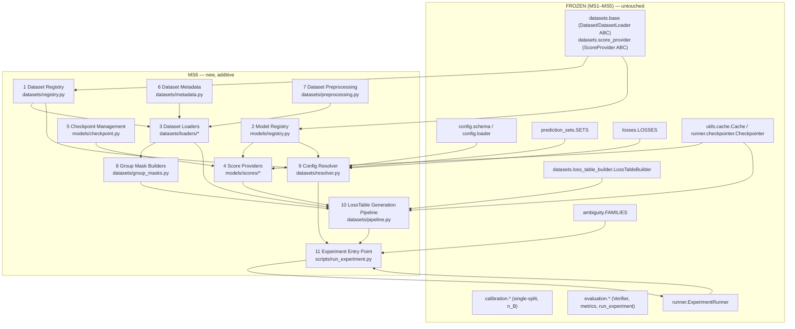
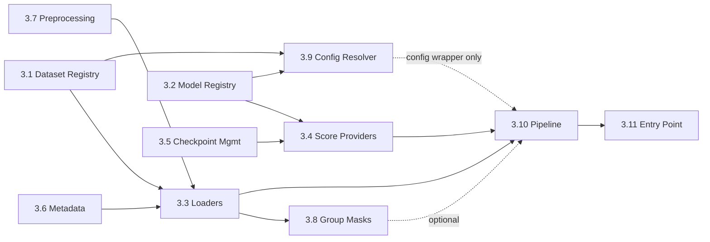

# MS6 ARCHITECTURE SPECIFICATION — Data-Adapter Milestone (wfcrc)

> **Status:** **FROZEN.** Open Questions Q1–Q3 (§8) are resolved and recorded below as
> frozen engineering policy. A consistency check (§8.4) found no contradiction between
> these decisions and §§0–7; architecture work on MS6 is complete. Implementation may
> proceed sub-milestone by sub-milestone per §5, starting with MS6.1. This document is
> the engineering-side companion to the vault's
> `Paper 1 - EXPERIMENT ENVIRONMENT AUDIT.md` (which identified the gap) and
> `Paper 1 - DATASET SELECTION AUDIT.md` (which froze the Phase-A dataset suite this
> design targets). It does not redesign MS1–MS5, does not revisit dataset selection, and
> does not discuss anything beyond the frozen Phase-A suite: Cityscapes, Cityscapes-C,
> ACDC (driving), MSD Task04_Hippocampus, MSD Task07_Pancreas, CIFAR-10, CIFAR-10.1,
> Kvasir-SEG.

---

## 0 · Scope & boundary statement

**The frozen boundary is `LossTableBuilder`.** Everything at or after it —
`wfcrc.datasets.loss_table_builder.LossTableBuilder`, `wfcrc.calibration.*`,
`wfcrc.ambiguity.*`, `wfcrc.losses.*`, `wfcrc.prediction_sets.*`, `wfcrc.evaluation.*`,
`wfcrc.runner.*`, `wfcrc.visualization.*`, `wfcrc.config.schema`/`.loader` — is **frozen
and untouched by MS6**. Every one of MS6's eleven components sits strictly *before* that
boundary: their entire job is to produce the `(cal_loss_table, test_loss_table)` pair
that `LossTableBuilder.build()` and `ExperimentRunner.run()` already accept today.

This is possible without touching any frozen file because of two design decisions
already made and documented in MS1–MS5:

1. `wfcrc.config.schema.DataConfig`/`ModelConfig` are already `{name, params}` —
   deliberately generic, per that module's own docstring, precisely so a later
   milestone's registry could resolve them without a schema change.
2. `ExperimentRunner.run()` and `run_experiment()` both take **already-built**
   `LossTable`s as direct parameters, precisely so a later milestone could produce those
   tables however it likes without changing either function's signature.

MS6 is therefore, by construction, **purely additive**: new packages/modules under
`wfcrc/datasets/`, a newly-populated `wfcrc/models/` (currently an empty placeholder
directory with no `__init__.py`), new `configs/*.yaml` layers, and one new top-level
script. The only permitted touch to an existing frozen file is an **additive append** to
`wfcrc/exceptions.py` (new exception subclasses only — the sanctioned pattern already
used for `RunnerError` in MS5, per that module's own docstring: "later milestones add
further subclasses ... rather than repurposing these") and to `wfcrc/datasets/__init__.py`
/ a new `wfcrc/models/__init__.py` (re-exporting new public names — the same kind of
append RC1 did for `RunnerError`). No existing class, function signature, or behavior in
MS1–MS5 changes.

---

## 1 · Executive summary

The Experiment Environment Audit scored the repository **≈55/100 executable-readiness**:
the calibration/evaluation engine (45%) and the split-hygiene/loss-table-assembly
contracts (10%) are done; everything from dataset loaders through group-mask builders
(45% combined) is either absent or abstract-contract-only. This is not a defect — it is
MS4's own documented scope boundary — but it means **zero** of the twelve frozen
experiments (E1–E12) can be configured or executed today.

MS6 closes that gap with eleven additive components, organized into four dependency
layers (§4) and eight independently-compilable, independently-testable sub-milestones
plus a freeze audit (§5), ending with a real `manifest.json` produced from real MSD
Task04_Hippocampus data through the unmodified MS5 `ExperimentRunner` (§5, MS6.8). The
design reuses three patterns MS1–MS5 already established rather than inventing new ones:
the `FAMILIES`-style name→class registry (MS2), the `Cache`/`Checkpointer`
content-addressed read-through pattern (MS1/MS5), and the "concrete class built from
direct objects first, config-driven resolution wrapped around it second" sequencing
`LossTableBuilder` itself already followed in MS4.

One architectural decision is **out of this repository's authority to make silently**:
which deep-learning runtime a `ScoreProvider` uses to run inference (§8, Open Question
Q1). Per the project's own "stop and document, do not invent" rule, this is flagged for
explicit sign-off before MS6.4 begins, with a recommendation.

---

## 2 · Architecture diagram



---

## 3 · Module specifications

For each component: purpose, responsibilities, public interface, dependencies,
interaction with existing modules, files to create, files that must remain untouched.

### 3.1 Dataset Registry

- **Purpose.** Name-keyed lookup from `config.data.name` to a concrete `DatasetLoader`
  subclass, mirroring the `wfcrc.ambiguity.FAMILIES` pattern (MS2) exactly — a plain
  module-level `dict`, no dynamic registration API, no metaclass magic.
- **Responsibilities.** Hold the mapping; nothing else. All validation of "is this name
  known" happens where it's consumed (Config Resolver, §3.9), the same way
  `_build_family` (in `wfcrc/runner/runner.py`) validates against `FAMILIES` today.
- **Public interface.**
  ```python
  DATASETS: dict[str, type[DatasetLoader]]
  ```
- **Dependencies.** `wfcrc.datasets.base.DatasetLoader` (frozen ABC) only.
- **Interaction with existing modules.** Consumed by the Config Resolver (§3.9), which
  looks up `DATASETS[config.data.name]` exactly as `_build_family` looks up
  `FAMILIES[cfg.type]`.
- **Files to create.** `wfcrc/datasets/registry.py`.
- **Files that must remain untouched.** `wfcrc/datasets/base.py`,
  `wfcrc/ambiguity/__init__.py` (the `FAMILIES` pattern is *copied*, not imported or
  extended), `wfcrc/config/schema.py`.

### 3.2 Model Registry

- **Purpose.** Name-keyed lookup from `config.model.name` to a concrete `ScoreProvider`
  subclass. Same pattern as §3.1, one layer over.
- **Responsibilities.** Hold the mapping only.
- **Public interface.**
  ```python
  MODELS: dict[str, type[ScoreProvider]]
  ```
- **Dependencies.** `wfcrc.datasets.score_provider.ScoreProvider` (frozen ABC) only.
- **Interaction with existing modules.** Consumed by the Config Resolver (§3.9).
- **Files to create.** `wfcrc/models/__init__.py` (this directory currently has *no*
  `__init__.py` — it is an empty placeholder per §6/§11 of `PROJECT_CONTEXT.md`; MS6 is
  what finally populates it), `wfcrc/models/registry.py`.
- **Files that must remain untouched.** `wfcrc/datasets/score_provider.py`.

### 3.3 Dataset Loaders

- **Purpose.** Concrete `DatasetLoader`/`Dataset` implementations for the frozen
  Phase-A suite, reduced to **four loader families** per the Dataset Selection Audit and
  Experiment Environment Audit §3: Cityscapes-format (serves Cityscapes + ACDC +
  Cityscapes-C), MSD/NIfTI (serves Hippocampus + Pancreas), CIFAR (serves CIFAR-10 +
  CIFAR-10.1), Kvasir/polyp.
- **Responsibilities.**
  - Implement `.load(split_name: str) -> Dataset` reading raw files from
    `data/<name>/` (paths already fixed by the Dataset Selection Audit §5 cache layout).
  - Construct and validate a `SplitManifest` (frozen, MS4) from the ids assigned to each
    split at construction time, so A1 hygiene (train ⟂ cal ⟂ test) is enforced by the
    already-frozen gate, not reimplemented.
  - Populate `Dataset.meta()` from Dataset Metadata (§3.6) — never inline literal
    version/license strings in a loader.
  - Apply Dataset Preprocessing (§3.7) transforms inside `__iter__`/`labels()` — resize/
    normalize for 2-D, resample/intensity-normalize for MSD 3-D volumes — identically
    across train/cal/test (Blueprint §6: no split-dependent preprocessing).
  - Cityscapes-C is a **corruption wrapper** *around* the Cityscapes loader, not an
    independent loader — it composes the Cityscapes `Dataset` with
    `wfcrc.datasets.preprocessing.apply_corruption` (§3.7) at read time, generating
    corrupted images on the fly rather than caching ~40 GB of corrupted pixels (Dataset
    Selection Audit risk R5).
  - ACDC reuses the Cityscapes-format loader unchanged (`root_dir` + label-map params
    only differ) — no new loader class, only a new `DATASETS["acdc"]` registry entry
    pointing at the same class with different constructor params.
- **Public interface.** One `DatasetLoader` subclass per family:
  ```python
  class CityscapesFormatLoader(DatasetLoader):
      def __init__(self, root_dir: str | Path, label_map: str = "cityscapes_19") -> None: ...
      def load(self, split_name: str) -> Dataset: ...

  class MSDNiftiLoader(DatasetLoader):
      def __init__(self, root_dir: str | Path, task: str) -> None: ...
      def load(self, split_name: str) -> Dataset: ...

  class CifarLoader(DatasetLoader):
      def __init__(self, root_dir: str | Path, variant: str = "cifar10") -> None: ...
      def load(self, split_name: str) -> Dataset: ...

  class KvasirLoader(DatasetLoader):
      def __init__(self, root_dir: str | Path) -> None: ...
      def load(self, split_name: str) -> Dataset: ...
  ```
  Each pairs with a concrete `Dataset` subclass (`CityscapesDataset`, `MSDDataset`,
  `CifarDataset`, `KvasirDataset`) implementing `__iter__`/`__len__`/`ids`/`labels`/`meta`.
- **Dependencies.** `wfcrc.datasets.base` (frozen), Dataset Metadata (§3.6), Dataset
  Preprocessing (§3.7), new I/O dependencies: Pillow (PNG/JPG — Cityscapes/ACDC/CIFAR/
  Kvasir), a NIfTI reader (nibabel or SimpleITK — MSD).
- **Interaction with existing modules.** Registered into `DATASETS` (§3.1); the
  `Dataset` objects they return are consumed unmodified by `LossTableBuilder.build()`
  (frozen, MS4) exactly as its test doubles are today.
- **Files to create.** `wfcrc/datasets/loaders/__init__.py`,
  `wfcrc/datasets/loaders/cityscapes.py`, `.../cityscapes_c.py`, `.../msd.py`,
  `.../cifar.py`, `.../kvasir.py`.
- **Files that must remain untouched.** `wfcrc/datasets/base.py`,
  `wfcrc/datasets/loss_table_builder.py`.

### 3.4 Score Providers

- **Purpose.** Concrete `ScoreProvider` implementations running a pretrained
  checkpoint's forward pass and caching per-example outputs, closing Experiment
  Environment Audit §5 ("no `ScoreProvider`, pretrained checkpoint, or inference path
  exists for any base model").
- **Responsibilities.**
  - `.scores_for(id_)` / `.scores_batch(ids)`: read-through cache keyed on
    `(model_fingerprint, id_)` via the frozen `wfcrc.utils.cache.Cache` — run inference
    only on a cache miss. This is exactly the cache role `wfcrc/utils/cache.py`'s own
    docstring reserves for "the score ... caches added in later milestones."
  - `.model_fingerprint()`: delegate to Checkpoint Management (§3.5)'s
    content-hash of the checkpoint file, so scores from different checkpoints never
    collide in the cache (Implementation Blueprint §9).
  - Shape contract: return `ScoreArray` in exactly the shape
    `PredictionSetConstructor.construct` already expects (`[H,W,K]`/`[K,H,W]` for
    segmentation, `[K]` for classification) — this module makes no change to that
    contract, it only has to satisfy it.
  - Reuse: `CityscapesScoreProvider` serves Cityscapes, ACDC, and Cityscapes-C
    identically (Dataset Selection Audit: "reused unchanged, zero extra training") —
    one class, three `DATASETS` entries pointing at three different `DatasetLoader`s all
    feeding the same `MODELS["cityscapes_segmenter"]` entry.
- **Public interface.**
  ```python
  class TorchScoreProvider(ScoreProvider):  # or per-model subclass
      def __init__(self, checkpoint_path: str | Path, cache_dir: str | Path, device: str = "cpu") -> None: ...
      def scores_for(self, id_: Hashable) -> ScoreArray: ...
      def scores_batch(self, ids: Sequence[Hashable]) -> ScoreBatch: ...
      def model_fingerprint(self) -> str: ...
  ```
- **Dependencies.** `wfcrc.datasets.score_provider.ScoreProvider` (frozen ABC),
  Checkpoint Management (§3.5), `wfcrc.utils.cache.Cache` (frozen), **PyTorch** as the
  DL runtime dependency (frozen decision, §8 Q1). PyTorch is a dependency of this
  component only — it must not appear in `wfcrc.calibration`, `wfcrc.ambiguity`,
  `wfcrc.losses`, `wfcrc.prediction_sets`, `wfcrc.evaluation`, or `wfcrc.runner`'s own
  requirements, which remain NumPy-based per §8 Q1. Every concrete `ScoreProvider`
  converts its PyTorch tensor output to a plain NumPy `ScoreArray`
  (`NDArray[np.float64]`) before returning — the frozen `ScoreProvider` ABC's return
  type is unchanged, so this conversion happens once, at the `scores_for`/
  `scores_batch` boundary, and nothing downstream ever sees a tensor.
- **Interaction with existing modules.** Registered into `MODELS` (§3.2); consumed by
  the LossTable Generation Pipeline (§3.10) exactly as `LossTableBuilder.build()`'s
  existing `score_provider` parameter already expects.
- **Files to create.** `wfcrc/models/scores/__init__.py`, one module per base model
  (`cityscapes_segmenter.py`, `msd_segmenter.py`, `cifar_classifier.py`,
  `kvasir_segmenter.py`).
- **Files that must remain untouched.** `wfcrc/datasets/score_provider.py`,
  `wfcrc/utils/cache.py`.

### 3.5 Checkpoint Management

- **Purpose.** Locate, hash, and load a pretrained checkpoint file; record and verify
  its training-split provenance against the current run's calibration/test ids — closing
  Dataset Selection Audit risk **R4** ("a public pretrained checkpoint whose training
  split overlaps the calibration pool would leak").
- **Responsibilities.**
  - Compute a stable content-hash fingerprint of the checkpoint file (reusing
    `wfcrc.utils.io.content_hash`, frozen).
  - Load framework-native checkpoint state (thin wrapper over whatever the Open Question
    Q1 runtime provides — `torch.load` or equivalent).
  - Hold/verify a small provenance record (`{checkpoint_id, trained_on_ids}`) against a
    given `cal_ids`/`test_ids` pair, raising on overlap — the checkpoint-provenance
    analogue of `assert_split_disjoint` (§3.11 is the general A1 gate; this is the
    narrower "did *this specific* checkpoint see *this specific* calibration data"
    check R4 asks for, which `assert_split_disjoint` cannot answer because it has no
    visibility into training-time splits from a third-party checkpoint).
- **Public interface.**
  ```python
  @dataclass(frozen=True)
  class CheckpointProvenance:
      checkpoint_id: str
      trained_on_ids: frozenset[Hashable]

  def load_checkpoint(path: str | Path) -> Any: ...
  def checkpoint_fingerprint(path: str | Path) -> str: ...
  def assert_no_checkpoint_leakage(
      provenance: CheckpointProvenance, cal_ids: Sequence[Hashable], test_ids: Sequence[Hashable]
  ) -> None: ...  # raises CheckpointProvenanceError
  ```
- **Dependencies.** `wfcrc.utils.io.content_hash` (frozen), one new additive exception
  (`CheckpointProvenanceError`, appended to `wfcrc/exceptions.py` per §0's sanctioned
  pattern).
- **Interaction with existing modules.** Used by Score Providers (§3.4) at construction;
  conceptually mirrors `wfcrc.datasets.base.assert_split_disjoint` (frozen) without
  importing or modifying it — a deliberately parallel, not shared, implementation, since
  the two checks operate on different data (loader-assigned split ids vs.
  externally-trained-on ids).
- **Files to create.** `wfcrc/models/checkpoint.py`.
- **Files that must remain untouched.** `wfcrc/utils/cache.py`, `wfcrc/utils/io.py`,
  `wfcrc/datasets/base.py`. `wfcrc/exceptions.py` receives one additive class only.

### 3.6 Dataset Metadata

- **Purpose.** Single canonical source for each Phase-A dataset's `version`/`license`/
  provenance, so `Dataset.meta()`'s contract is satisfied consistently and the Dataset
  Selection Audit §5 acquisition table has one machine-readable home instead of being
  re-transcribed per loader.
- **Responsibilities.** Hold static metadata only — no I/O, no computation.
- **Public interface.**
  ```python
  @dataclass(frozen=True)
  class DatasetMetadata:
      name: str
      version: str
      license: str
      source_url: str
      extra: Mapping[str, Any] = field(default_factory=dict)
      def to_dict(self) -> dict[str, Any]: ...

  DATASET_METADATA: dict[str, DatasetMetadata]  # keyed identically to DATASETS
  ```
- **Dependencies.** stdlib `dataclasses` only.
- **Interaction with existing modules.** Each concrete `Dataset.meta()` (§3.3) returns
  `DATASET_METADATA[name].to_dict()`, satisfying the frozen `Dataset.meta()` abstract
  contract (MS4) without modifying it.
- **Files to create.** `wfcrc/datasets/metadata.py`.
- **Files that must remain untouched.** `wfcrc/datasets/base.py`.

### 3.7 Dataset Preprocessing

- **Purpose.** Shared, dataset-agnostic transforms (resize/normalize/resample) and the
  Cityscapes-C corruption suite, so no loader reimplements image/volume math, and no
  transform can silently differ between train/cal/test (which would violate Blueprint
  §6).
- **Responsibilities.**
  - Pure functions operating on already-loaded arrays — **no file I/O** here (that
    stays in the loader, keeping this module trivially unit-testable on synthetic
    arrays).
  - Deterministic given an explicit seed for any randomized transform (corruption
    parameter sampling), routed through the frozen `wfcrc.utils.seeds.derive_seed` — no
    bare global RNG, per §9 of `PROJECT_CONTEXT.md`.
  - Corruption suite: 15 corruption types × severities 1–5 (Experiment Blueprint §5),
    applied on the fly to Cityscapes val images, never cached as pixels (Dataset
    Selection Audit risk R5).
- **Public interface.**
  ```python
  def resize_and_normalize(image: NDArray, target_size: tuple[int, int], mean: Sequence[float], std: Sequence[float]) -> NDArray: ...
  def resample_volume(volume: NDArray, spacing: tuple[float, ...], target_spacing: tuple[float, ...]) -> NDArray: ...
  def apply_corruption(image: NDArray, corruption_name: str, severity: int, seed: int) -> NDArray: ...
  CORRUPTION_NAMES: tuple[str, ...]
  ```
- **Dependencies.** Pillow / a NIfTI-adjacent resampling routine, `imagecorruptions` as
  the reference image-corruption implementation (frozen decision, §8 Q2, subject to the
  protocol-verification record required there before the Cityscapes-C adapter itself is
  frozen), `wfcrc.utils.seeds.derive_seed` (frozen).
- **Interaction with existing modules.** Called from inside Dataset Loaders (§3.3) only;
  nothing downstream of a `Dataset` object is aware this module exists.
- **Files to create.** `wfcrc/datasets/preprocessing.py`, `wfcrc/datasets/corruptions.py`.
- **Files that must remain untouched.** Everything in `calibration/`, `losses/`,
  `ambiguity/`, `prediction_sets/`, `evaluation/`, `runner/`, `visualization/`.

### 3.8 Group Mask Builders

- **Purpose.** Derive `FiniteGroupFamily`-compatible group masks and
  `ExperimentRunner`/`per_group_risk`-compatible group index lists from a loaded
  `Dataset`'s labels — closing the Experiment Environment Audit's explicitly named gap:
  "the `finite_group` family accepts masks, but nothing derives region/organ/class
  groups from a dataset."
- **Responsibilities.**
  - Build **row-index tuples into a specific split's `LossTable`** — Cityscapes/
    ADE20K-style class/region groups (E2), MSD organ groups (E2, E5).
  - Validate non-empty groups itself and raise early with a dataset-specific message
    (fail fast at mask-construction time, mirroring `FiniteGroupFamily`'s own
    validation, not replacing it — the family still validates independently when it
    receives whatever this module hands it).
  - **Critical invariant to preserve:** group masks are **split-relative row indices**.
    `FamilyConfig.masks` (consumed at calibration time, indexes the *calibration*
    `LossTable`) and `ExperimentRunner.run(..., groups=...)` (consumed at evaluation
    time, indexes the *test* `LossTable`) are two different consumers over two different
    tables — this module must be invoked once per split and must never let a
    calibration-split index tuple reach the test-split `groups=` parameter or vice
    versa. This is flagged explicitly because the frozen `FiniteGroupFamily`/
    `per_group_risk` have no way to detect a split mismatch themselves — it silently
    produces wrong-but-plausible results if violated (Risk §7, R-GM1).
- **Public interface.**
  ```python
  class GroupMaskBuilder(ABC):
      @abstractmethod
      def build(self, dataset: Dataset, split_ids: Sequence[Hashable]) -> tuple[tuple[int, ...], ...]: ...

  class ClassGroupMaskBuilder(GroupMaskBuilder): ...   # Cityscapes-style
  class OrganGroupMaskBuilder(GroupMaskBuilder): ...   # MSD-style
  ```
- **Dependencies.** `wfcrc.datasets.base.Dataset` (frozen), `wfcrc.exceptions.FamilyError`
  (reused, not modified).
- **Interaction with existing modules.** Output feeds `FamilyConfig.masks`
  (`wfcrc.config.schema`, frozen — masks are already `tuple[tuple[int,...],...]`, so no
  schema change) and/or `ExperimentRunner.run`'s `groups` parameter (frozen, MS5).
- **Files to create.** `wfcrc/datasets/group_masks.py`.
- **Files that must remain untouched.** `wfcrc/ambiguity/finite_group.py`,
  `wfcrc/evaluation/metrics.py`, `wfcrc/config/schema.py`.

### 3.9 Config Resolver

- **Purpose.** Turn a validated `Config`'s `data`/`model`/`sets`/`loss` sections into
  concrete instances — the exact gap the MS5 `ExperimentRunner` docstring names as
  deferred: *"resolves only `config.family` ... the config-driven dataset stage remains
  future work."*
- **Responsibilities.**
  - `DATASETS[config.data.name](**config.data.params)` → `DatasetLoader`.
  - `MODELS[config.model.name](**config.model.params)` → `ScoreProvider`.
  - Reuse the **already-existing** `SETS`/`LOSSES` registries (confirmed present per
    Experiment Environment Audit §4: `sets.name → SETS`, `loss.name → LOSSES` already
    resolve) for `PredictionSetConstructor`/`LossEvaluator` — MS6 does not build these,
    it only calls them, exactly as `_build_family` already calls `FAMILIES`.
  - Raise a new, additive `DatasetError`/`ModelError` (mirroring `FamilyError`'s role
    for `_build_family`) on an unknown `data.name`/`model.name`.
- **Public interface.**
  ```python
  @dataclass(frozen=True)
  class ResolvedComponents:
      dataset_loader: DatasetLoader
      score_provider: ScoreProvider
      constructor: PredictionSetConstructor
      loss: LossEvaluator

  def resolve_components(config: Config) -> ResolvedComponents: ...
  ```
- **Dependencies.** Dataset Registry (§3.1), Model Registry (§3.2), the frozen
  `wfcrc.prediction_sets.SETS` and `wfcrc.losses.LOSSES` registries, `wfcrc.config.schema`
  (frozen, read-only).
- **Interaction with existing modules.** Called by the LossTable Generation Pipeline's
  config-driven wrapper (§3.10). Deliberately lives under `wfcrc/datasets/`, not
  `wfcrc/config/`, so the MS1-frozen `config` package itself needs no new file.
- **Files to create.** `wfcrc/datasets/resolver.py`.
- **Files that must remain untouched.** `wfcrc/config/schema.py`,
  `wfcrc/config/loader.py`, `wfcrc/prediction_sets/__init__.py`,
  `wfcrc/losses/__init__.py`.

### 3.10 LossTable Generation Pipeline

- **Purpose.** The single "load splits → score → build tables" orchestration that
  `ExperimentRunner.run()` currently requires its caller to assemble by hand. Composes
  Dataset Loaders (§3.3) + Score Providers (§3.4) + optional Group Mask Builders (§3.8)
  + the frozen `LossTableBuilder` (unmodified) into one call.
- **Responsibilities.**
  - Load `train`/`calibration`/`test` `Dataset` splits via a given `DatasetLoader`
    (train is loaded only if a `ScoreProvider` needs it for provenance checking, §3.5 —
    the base model itself is never trained here).
  - Build `cal_loss_table`/`test_loss_table` via `LossTableBuilder.build()` (frozen,
    called twice — once per split — exactly as its existing signature already supports).
  - Optionally build `cal_groups`/`test_groups` via a `GroupMaskBuilder` (§3.8), one
    call per split, preserving the split-relative invariant from §3.8.
  - Cache the assembled `LossTable`s via the frozen `Checkpointer`/`Cache`, keyed on
    `(model_fingerprint, dataset identity, lambda_grid)`, so re-running an unchanged
    config does not re-score.
  - **Two public entry points**, split deliberately (see §5 rationale for MS6.5 vs
    MS6.6): a direct-object function testable with synthetic doubles exactly like
    `LossTableBuilder` itself was in MS4, and a thin config-driven wrapper added one
    sub-milestone later once the Config Resolver (§3.9) exists.
- **Public interface.**
  ```python
  @dataclass(frozen=True)
  class LossTablesBundle:
      cal_loss_table: LossTable
      test_loss_table: LossTable
      cal_groups: tuple[tuple[int, ...], ...] | None
      test_groups: tuple[tuple[int, ...], ...] | None

  def build_loss_tables(
      dataset_loader: DatasetLoader,
      score_provider: ScoreProvider,
      constructor: PredictionSetConstructor,
      loss: LossEvaluator,
      lambda_grid: ArrayLike,
      *,
      group_builder: GroupMaskBuilder | None = None,
  ) -> LossTablesBundle: ...                                    # MS6.5

  def build_loss_tables_from_config(config: Config) -> LossTablesBundle: ...   # MS6.6
  ```
- **Dependencies.** `wfcrc.datasets.loss_table_builder.LossTableBuilder` (frozen,
  unmodified — the one existing concrete class this whole milestone builds an on-ramp
  to), `wfcrc.utils.cache.Cache` (frozen), Config Resolver (§3.9, only for the
  `_from_config` wrapper).
- **Interaction with existing modules.** This is what the Experiment Entry Point (§3.11)
  calls before handing off to `ExperimentRunner.run()` — it produces exactly the two
  arguments that function already requires, unchanged.
- **Files to create.** `wfcrc/datasets/pipeline.py`.
- **Files that must remain untouched.** `wfcrc/datasets/loss_table_builder.py`,
  `wfcrc/calibration/*`, `wfcrc/runner/runner.py`.

### 3.11 Experiment Entry Point

- **Purpose.** The CLI a researcher actually runs — `python scripts/run_experiment.py
  --config configs/experiment_E1.yaml` — tying `load_config` → LossTable Generation
  Pipeline (§3.10) → `ExperimentRunner.run()`/`.run_sweep()` together for a real,
  named dataset/model, closing the loop the MS5 runner's own docstring left open.
- **Responsibilities.**
  - Parse `--config` (repeatable, for layering: `default.yaml ← dataset_*.yaml ←
    family_*.yaml ← experiment_E*.yaml`), `--override` (dotted-key), `--run-dir`,
    `--sweep-config` (optional path to a sweep-grid YAML), `--force-recompute` —
    mirroring `scripts/reproduce.py`'s existing argparse shape exactly, not inventing a
    new CLI convention.
  - Call `wfcrc.config.loader.load_config` (frozen) → `build_loss_tables_from_config`
    (§3.10) → optionally `Group Mask Builders` (§3.8) for `groups=` → `ExperimentRunner`
    (frozen, MS5) `.run()` or `.run_sweep()`.
  - Print/return the resulting `run_dir`/`manifest.json` path; exit non-zero on
    `VerificationError`/`RunnerError`/`ConfigError` (all frozen exceptions, propagated
    unchanged).
- **Public interface.**
  ```python
  def main(argv: Sequence[str] | None = None) -> int: ...
  ```
- **Dependencies.** `wfcrc.config.loader.load_config` (frozen), LossTable Generation
  Pipeline (§3.10), `wfcrc.runner.ExperimentRunner` (frozen, MS5), Group Mask Builders
  (§3.8, optional).
- **Interaction with existing modules.** Top of the whole MS6 stack — nothing in
  MS1–MS5 depends on it; it only calls downward into already-frozen code.
- **Files to create.** `scripts/run_experiment.py`,
  `tests/unit/scripts/test_run_experiment.py`.
- **Files that must remain untouched.** `scripts/reproduce.py` (the synthetic
  golden-file harness is untouched — this is a new, separate script), `Makefile` gets
  at most one new additive target (`make run-experiment`), not a modification to
  `make reproduce`.

---

## 4 · Dependency graph

| Component | Depends on (MS6) | Depends on (frozen) |
|---|---|---|
| 3.1 Dataset Registry | — | `datasets.base.DatasetLoader` |
| 3.2 Model Registry | — | `datasets.score_provider.ScoreProvider` |
| 3.5 Checkpoint Management | — | `utils.io`, `exceptions` (additive) |
| 3.6 Dataset Metadata | — | — |
| 3.7 Dataset Preprocessing | — | `utils.seeds` |
| 3.3 Dataset Loaders | 3.1, 3.6, 3.7 | `datasets.base` |
| 3.4 Score Providers | 3.2, 3.5 | `datasets.score_provider`, `utils.cache` |
| 3.8 Group Mask Builders | 3.3 (needs a `Dataset` instance to run against; type-only dependency on `datasets.base.Dataset`) | `exceptions.FamilyError` |
| 3.9 Config Resolver | 3.1, 3.2 | `config.schema`, `prediction_sets.SETS`, `losses.LOSSES` |
| 3.10 LossTable Generation Pipeline | 3.3, 3.4, 3.8 (optional), 3.9 (config wrapper only) | `datasets.loss_table_builder.LossTableBuilder`, `utils.cache` |
| 3.11 Experiment Entry Point | 3.10 | `config.loader`, `runner.ExperimentRunner` |



**Reading the graph:** three components (Registries ×2, Checkpoint Management, Metadata,
Preprocessing — five total) have **no MS6-internal dependencies** and can be built in any
order or in parallel. Loaders and Score Providers each depend on exactly two of those five.
Group Mask Builders depends only on the *type* `Dataset`, not on any concrete loader
existing — it can be implemented and unit-tested against a synthetic `Dataset` double at
any point, independent of §3.3's progress; it is sequenced late (§5) only because nothing
consumes its *output* until the Pipeline exists. The Pipeline is the first component that
requires *concrete* instances (a real loader + real provider) to be meaningfully exercised
end-to-end, which is why it is deliberately split into a direct-object form (testable
immediately with doubles) and a config-driven wrapper (added once the Resolver exists).

---

## 5 · Milestone breakdown

Each sub-milestone compiles independently (no forward references to a later
sub-milestone's module) and is testable independently (unit tests need no real
downloaded data; only the integration test at the end of MS6.3 onward needs it, and only
for Hippocampus, per the Dataset Selection Audit's own "cheapest end-to-end validation"
recommendation).

- **MS6.1 — Dataset Registry & Model Registry** (§3.1, §3.2). Two empty-but-typed
  dicts plus the new `wfcrc/models/__init__.py` package file. No concrete loader/provider
  exists yet — `DATASETS`/`MODELS` start empty and are populated additively by later
  sub-milestones, the same way `FAMILIES` was fully populated in one MS2 pass but this
  milestone establishes the *pattern* first, deliberately, since MS6.1 has zero other
  dependencies and de-risks the pattern before any dataset-specific code exists.
- **MS6.2 — Generic Dataset Abstractions** (§3.6, §3.7). Dataset Metadata dataclass +
  registry (populated with the seven Phase-A entries' real version/license strings from
  the Dataset Selection Audit §5 table) and the preprocessing/corruption function
  library, unit-tested on synthetic arrays only.
- **MS6.3 — Concrete Dataset Loaders, starting with MSD Hippocampus** (§3.3). Build
  `MSDNiftiLoader` first (cheapest, ~30 MB, de-risks the NIfTI/3-D path before the
  heavier Cityscapes/MSD-Pancreas work), then Cityscapes-format (+ ACDC + Cityscapes-C
  wrapper), CIFAR, Kvasir, in that order — matching the Dataset Selection Audit's own
  §9 recommended download order exactly, so loader implementation order and data
  acquisition order stay aligned.
- **MS6.4 — Score Providers & Checkpoint Management** (§3.4, §3.5). Build the
  Hippocampus score provider first (pairs with MS6.3's first loader), gated on Open
  Question Q1 (§8) being resolved before this sub-milestone starts.
- **MS6.5 — LossTable Generation Pipeline (direct-object form)** (§3.10,
  `build_loss_tables` only — *not* the config-driven wrapper, deliberately deferred to
  MS6.6 to avoid a forward dependency on the Resolver). Testable end-to-end against the
  Hippocampus loader/provider from MS6.3/6.4, or against synthetic doubles for the other
  three loader families before they land.
- **MS6.6 — Experiment Configuration Layer** (§3.9 Config Resolver +
  `build_loss_tables_from_config` + the `configs/dataset_*.yaml` /
  `configs/family_*.yaml` / `configs/experiment_E{1..12}.yaml` layers the Experiment
  Environment Audit §4 found entirely absent).
- **MS6.7 — Group Mask Builders** (§3.8). Independent of MS6.3–6.6's *implementation*
  (only needs the `Dataset` type), but exercised for real for the first time here against
  Hippocampus's anterior/posterior two-group split (the Dataset Selection Audit's own
  example) and Cityscapes' class/region groups.
- **MS6.8 — End-to-end validation with a single dataset** (§3.11 Experiment Entry
  Point, wired against MSD Hippocampus specifically). Produces the first real
  `manifest.json` from real data through the unmodified `ExperimentRunner`, closing the
  Experiment Environment Audit's own recommended next step verbatim: *"re-audit once one
  loader + one score provider resolve an `experiment_*.yaml` into a real `LossTable`,
  then flip to READY FOR DATASET DOWNLOAD."*
- **MS6 Freeze Audit.** The mandatory `PROJECT_CONTEXT.md` §1 workflow step — external
  architecture audit against this document and the frozen specs, before MS6 is declared
  frozen and the remaining three Phase-A loader families (Cityscapes/ACDC/-C, CIFAR,
  Kvasir) proceed under it without a second full audit.

---

## 6 · Test plan

Every unit test in MS6.1–MS6.7 runs against **synthetic fixtures**, never a real
downloaded dataset — mirroring `LossTableBuilder`'s own MS4 precedent ("tests exercise it
against small synthetic test doubles, never a real dataset") and keeping CI free of the
~40 GB Phase-A footprint. Only MS6.8's integration test touches real (Hippocampus-scale,
~30 MB) data, and only outside default CI (§7, R-DATA1).

| Milestone | Unit tests | Integration tests | Expected outputs | Failure modes |
|---|---|---|---|---|
| **MS6.1** | `DATASETS`/`MODELS` are `dict[str, type[...]]`; empty-registry lookup raises the documented resolver error (added in MS6.6, tested there against a real empty case here as a placeholder assertion) | — | Importable empty registries | Registering a class that isn't a `DatasetLoader`/`ScoreProvider` subclass — reject via a unit test asserting `issubclass` at registration, not at runtime |
| **MS6.2** | `DatasetMetadata.to_dict()` round-trip; each of the 7 Phase-A entries present with non-empty `version`/`license`; `resize_and_normalize`/`resample_volume`/`apply_corruption` on small synthetic arrays, incl. degenerate 1×1 and all-zero inputs; corruption determinism (same seed → identical output, different seed → different output) | — | Deterministic transform outputs; complete metadata table | Missing metadata entry for a Phase-A name → `KeyError` surfaced as a clear assertion failure at registry-construction time, not deferred to runtime |
| **MS6.3** | Each loader against a **tiny synthetic fixture** mimicking its real format exactly (2×2 PNG pair + label for Cityscapes-format; a tiny synthetic NIfTI volume for MSD; a handful of CIFAR binary-batch bytes; a small JPG+mask pair for Kvasir): `.load(split)` returns a `Dataset` with correct `ids()`/`labels()`/`meta()`/`len()`; `SplitLeakageError` raised on a deliberately overlapping fixture split | **MS6.3 only, gated behind an opt-in marker/env var (not default CI):** `MSDNiftiLoader` against the real, downloaded MSD Task04_Hippocampus data — full split load, `len()` matches the ~260-case dataset | A `Dataset` whose `__iter__` yields exactly `len()` triples, ids match `ids()` | Corrupt/truncated fixture file → `SerializationError`/loader-specific `ValueError`; split-id overlap → `SplitLeakageError` (already frozen, just exercised) |
| **MS6.4** | `ScoreProvider` against a stub checkpoint (a tiny synthetic state file) + fixture `Dataset`: `scores_for`/`scores_batch` shapes match the `PredictionSetConstructor` contract; `model_fingerprint()` stable across two constructions of the same checkpoint, different across two different checkpoint files; cache hit avoids a second inference call (mock-counted) | **Opt-in:** real Hippocampus checkpoint (once trained/obtained) scoring a handful of real cases, checked against a hand-computed expected shape | Cached `ScoreArray`s; stable fingerprint | `CheckpointProvenanceError` on a deliberately overlapping provenance/`cal_ids` fixture; missing checkpoint file → clear `OSError`/`WFCRCError`, not a silent empty score |
| **MS6.5** | `build_loss_tables` against synthetic `DatasetLoader`+`ScoreProvider`+`PredictionSetConstructor`+`LossEvaluator` doubles (same pattern `LossTableBuilder`'s own MS4 tests use): output `LossTablesBundle` shapes match `(len(split), len(lambda_grid))`; checkpoint/cache round-trip (`get_or_compute` called twice with identical inputs returns identical `LossTable` without recomputation, mock-counted) | **Opt-in:** MSD Hippocampus loader + score provider from MS6.3/6.4, full pipeline run producing real `cal_loss_table`/`test_loss_table` | A `LossTablesBundle` whose tables satisfy `LossTable`'s own frozen validation (shape, finiteness) | Empty dataset/lambda_grid → propagated `ValueError` from the frozen `LossTableBuilder`, unchanged |
| **MS6.6** | `resolve_components` against registries pre-populated with fixture classes: correct instance types returned; unknown `data.name`/`model.name` raises the new `DatasetError`/`ModelError`; every `configs/experiment_E{1..12}.yaml` layer parses through the frozen `load_config` without a `ConfigError` | **Opt-in:** `build_loss_tables_from_config` against a real `configs/experiment_E1.yaml` pointed at Hippocampus | A fully validated `Config` for each of the 12 experiment layers | Config layer referencing a `data.name` not yet in `DATASETS` (e.g. `cityscapes` before MS6.3's Cityscapes loader lands) → explicit `DatasetError`, never a silent `None` |
| **MS6.7** | `ClassGroupMaskBuilder`/`OrganGroupMaskBuilder` against a synthetic `Dataset` with known labels: returned masks are non-empty, non-overlapping-by-construction where expected, and index only within `[0, len(split_ids))`; empty-group input raises `FamilyError` early | **Opt-in:** Hippocampus anterior/posterior masks against real labels, fed into `FiniteGroupFamily` (frozen) without error | `tuple[tuple[int,...],...]` masks accepted unchanged by the frozen `FiniteGroupFamily` constructor | Split-mismatch regression test (R-GM1, §7): asserts that calibration-split masks and test-split masks built from the same `Dataset`/labels are *not* interchangeable (deliberately fails if someone "simplifies" by building masks once and reusing across splits) |
| **MS6.8** | `scripts/run_experiment.py main()` against a fixture config + fixture loader/provider registered under test-only names: exits 0, writes `manifest.json`, `VerificationError` path exits non-zero without writing a manifest (mirrors `ExperimentRunner`'s own frozen STOP-gate behavior) | **The milestone's own deliverable:** `python scripts/run_experiment.py --config configs/experiment_E1_hippocampus.yaml` against real, downloaded MSD Hippocampus data, end to end, producing a real `manifest.json` with `verification_passed: true` | A `run_dir/manifest.json` on real data, first time ever in this repository | Any frozen-layer failure (verify STOP-gate, `PreconditionError`, `FamilyError`) propagates unchanged — MS6.8's own test asserts the entry point does *not* swallow or reinterpret any frozen exception |
| **MS6 Freeze Audit** | N/A (review, not new tests) | Re-run of every "opt-in" integration test above in one pass, plus `ruff`/`black`/`mypy --strict`/`pytest --cov` over the full `wfcrc/datasets/`+`wfcrc/models/` additions | 100% line+branch coverage on new modules (matching the project's own §9 target), zero MyPy-strict errors | Any finding here is fixed per the standard workflow (`Implement → gates → review → audit → fix only necessary issues → freeze`), not silently deferred |

---

## 7 · Risk assessment

| ID | Risk | Severity | Mitigation |
|---|---|---|---|
| **R-DL1** | No DL runtime dependency exists in the repo today; introducing one (PyTorch, §8.1) risks scope creep into the frozen NumPy-based core if not isolated | Medium (was High before Q1 froze the boundary) | §8.1's explicit constraints (PyTorch confined to §3.4/§3.5; core stays NumPy-only) checked at MS6.4 freeze via `pyproject.toml`/import-boundary review |
| **R-GM1** | Group masks are split-relative row indices; a calibration-split mask fed to `ExperimentRunner`'s test-split `groups=` (or vice versa) silently produces plausible-but-wrong per-group risk numbers — neither `FiniteGroupFamily` nor `per_group_risk` can detect this from inside the frozen layer | High (silent correctness failure, not a crash) | §3.8 invariant statement + a dedicated regression test (§6, MS6.7) asserting non-interchangeability |
| **R-CKPT1** | A public pretrained checkpoint's undisclosed training split may overlap the calibration pool (Dataset Selection Audit R4) | High (violates A1 hygiene, invalidates the exact-validity guarantee) | Checkpoint Management's `assert_no_checkpoint_leakage` (§3.5), mandatory at every `ScoreProvider` construction, not optional |
| **R-DATA1** | Real Phase-A data (~40 GB) must not become a CI dependency | Medium | All real-data integration tests are opt-in (env var/marker), never in the default `pytest`/CI run; unit tests use synthetic fixtures exclusively (§6) |
| **R-DEP1** | New dependencies (Pillow, a NIfTI reader, a corruption library, a DL runtime) must be added to `pyproject.toml`/`requirements/{base,lock}.txt` and re-verified in an isolated venv, exactly as MS5 did for `matplotlib` (RC1 §7) | Medium | Follow the RC1 precedent literally: add, regenerate lockfile, verify `pip install -r lock.txt` → `pip install --no-deps -e .` → new entry point runs, in a disposable venv |
| **R-SCOPE1** | Temptation to "simplify" by having Dataset Loaders call `LossTableBuilder` directly, skipping the Pipeline layer (§3.10) | Low–Medium | Explicitly disallowed by §0: nothing but `LossTableBuilder.build()`'s existing two callers (`LossTableBuilder`'s own tests, and now the Pipeline) may construct it directly — keeps the frozen boundary crisp and auditable |
| **R-PERF1** | MSD-Pancreas base-model training (~1–2 GPU-days, Dataset Selection Audit §6) is the single heaviest Phase-A item; it is **not** MS6.8's target | Low (already mitigated by dataset selection) | MS6.8 deliberately targets Hippocampus, not Pancreas, for exactly this reason (already the Dataset Selection Audit's own recommendation, §9 item 2) |
| **R-EXC1** | Additive exception subclasses (`CheckpointProvenanceError`, `DatasetError`, `ModelError`) could be read as "modifying" the frozen `exceptions.py` | Low | Explicitly the sanctioned pattern already used for `RunnerError` in MS5 (§0) — flag in the freeze audit as intentional, not a scope violation |

---

## 8 · Frozen decisions (Q1–Q3)

Q1–Q3 were flagged in the original draft of this document as open questions requiring
explicit sign-off, per `PROJECT_CONTEXT.md` §1 ("if something appears missing,
ambiguous, or contradictory: STOP. Document it. Do not invent behavior."). All three are
now resolved by explicit user decision and are recorded here as **frozen engineering
policy for MS6**. Nothing below is inferred or defaulted — each item is the decision as
given, verbatim in substance.

### 8.1 Q1 — Deep-learning runtime: **PyTorch (frozen)**

PyTorch is the reference runtime for concrete Score Providers (§3.4) and model/
checkpoint inference (§3.5). Binding constraints, all already reflected in §3.4/§3.5
above:

- PyTorch must remain strictly upstream of the frozen `LossTableBuilder` boundary (§0).
- The existing WFCRC calibration/evaluation core (`wfcrc.calibration`, `wfcrc.ambiguity`,
  `wfcrc.losses`, `wfcrc.prediction_sets`, `wfcrc.evaluation`, `wfcrc.runner`) remains
  NumPy-based and must not acquire a PyTorch dependency, directly or transitively through
  its own `pyproject.toml` extras.
- Score Providers must convert their PyTorch output into the existing, frozen,
  dataset-agnostic `ScoreArray` (`NDArray[np.float64]`) representation before returning
  from `scores_for`/`scores_batch` — the `ScoreProvider` ABC's contract is unchanged.
- No training-framework functionality is introduced into WFCRC. Base-model *training*
  (e.g. the MSD-Pancreas nnU-Net-style fold training the Dataset Selection Audit costs
  at ~1–2 GPU-days) happens **outside** this repository, exactly as that audit already
  assumes ("prefer a public pretrained checkpoint"); MS6 only loads and runs inference
  against an already-trained checkpoint (Checkpoint Management, §3.5).
- Where mature external model implementations are used (e.g. an nnU-Net-style
  architecture for MSD), MS6 wraps them as **adapters** inside `wfcrc/models/scores/`
  rather than reimplementing training-framework functionality inside WFCRC.

### 8.2 Q2 — Cityscapes-C corruption implementation: **`imagecorruptions`, subject to protocol verification (frozen)**

`imagecorruptions` is the reference implementation for the Cityscapes-C corruption
wrapper (§3.3, §3.7). The frozen scientific artifact is **the corruption protocol
itself** (15 corruption types × severities 1–5, per Experiment Blueprint §5), not the
Python package that happens to implement it. Before the Cityscapes-C adapter (part of
§3.3's MS6.3 work) is itself frozen, MS6 must explicitly record, in that adapter's own
module docstring and in a corruption-protocol note alongside it:

- the exact corruption types used;
- the severity levels (1–5) and their parameterization;
- the deterministic-seeding scheme (routed through `wfcrc.utils.seeds.derive_seed`,
  frozen, per §3.7);
- the `imagecorruptions` library name and pinned version (`requirements/lock.txt`);
- any deviations from the published benchmark protocol, with justification.

This record exists specifically so that **a future library upgrade or replacement
cannot silently alter E3's corruption inputs** — the pinned version plus the recorded
parameterization together are what makes an E3 run reproducible, not the library's
current behavior alone. This requirement is additive documentation scope on top of
§3.3/§3.7's existing design; it does not change either module's public interface.

**Status update (MS6.2 Resolution Pass).** The protocol verification this section
required was performed — ahead of schedule, during MS6.2 rather than the MS6.3
Cityscapes-C adapter — because `wfcrc/datasets/corruptions.py` (§3.7) needed a working
`apply_corruption` before MS6.2 could be accepted. Result: `imagecorruptions==1.1.2`'s
15 canonical corruption names and severities match the frozen protocol exactly, but 3 of
15 (`glass_blur`, `fog`, `impulse_noise`) required a narrow, individually-verified
compatibility path against this project's modern `numpy`/`scikit-image` versions (root
causes: a removed skimage kwarg, a removed NumPy dtype alias, and a changed skimage RNG
default) rather than running unmodified. `glass_blur`/`fog`'s paths are proven
bit-identical to a dedicated reference environment across all 5 severities; `impulse_noise`'s
path preserves the exact algorithm/parameters and restores determinism but is not
bit-identical to that reference (a PRNG-bit-generator artifact, not a protocol change) —
full numeric results and root-cause analysis are in `corruptions.py`'s own module
docstring, which is the authoritative record this section anticipated. `scikit-image` is
consequently a second direct dependency alongside `imagecorruptions` (§3.7's dependency
line, originally naming only "an image-corruption implementation", undersold this by one
package). No change to this section's requirements list, corruption types, or severities.

### 8.3 Q3 — Real-data integration test policy: **opt-in, marker-gated (frozen)**

The existing default test suite (641 tests as of RC1) must remain offline, deterministic,
fast, and independent of licensed datasets, external checkpoints, and GPU availability.
This was already §6's working assumption (every "Opt-in" cell in that table); it is now
frozen policy, not an assumption:

- MS6 unit tests and normal integration tests use synthetic fixtures or minimal local
  test assets only (§6) — never a real downloaded Phase-A dataset, a real checkpoint, or
  network access.
- Tests requiring a real dataset, a large checkpoint, network access, licensed data, or
  GPU execution belong to a clearly separated, explicitly opt-in real-data integration
  test category (a dedicated `pytest` marker, e.g. `@pytest.mark.real_data`, registered
  in `pyproject.toml`'s `[tool.pytest.ini_options]` `markers` list to satisfy the
  project's existing `--strict-markers` setting) and are excluded from the default
  `python -m pytest` / CI run.
- The default suite must continue to run to completion, unchanged in count and
  determinism, without downloading any external research asset — MS6.1 through MS6.7's
  default-suite tests are all synthetic-fixture-only by construction (§6); no `pytest`
  marker infrastructure is required until MS6.3's first loader-format fixture test, and
  no real-data-marked test exists until MS6.8.

### 8.4 Consistency check

Cross-checking §8.1–§8.3 against §§0–7 of this document for contradictions:

- **§0 scope boundary** ("everything after `LossTableBuilder` is frozen and untouched")
  is consistent with Q1: PyTorch is confined to §3.4/§3.5, both strictly upstream of that
  boundary; no frozen module gains a PyTorch import.
- **§3.4/§3.5** already specified the tensor→`ScoreArray` conversion and
  adapter-over-checkpoint framing before Q1 was resolved; Q1's decision confirms rather
  than contradicts that design (§8.1's edits above only make the constraint explicit,
  they do not change §3.4/§3.5's interfaces or file lists).
- **§3.3/§3.7** already named `imagecorruptions` as the Dataset Selection Audit's own
  suggestion and already required deterministic, seeded corruption generation; Q2 adds a
  documentation obligation (the protocol record) on top of an already-compatible design,
  no interface or dependency-boundary change.
- **§6 test plan** already specified every real-data cell as "Opt-in, gated behind an
  opt-in marker/env var (not default CI)" and every default-suite cell as
  synthetic-fixture-only; Q3 formalizes exactly that split and adds the concrete
  mechanism (a registered `pytest` marker), with no change to which tests were already
  planned as opt-in vs. default.
- **No component in §3, no risk in §7, and no acceptance criterion in §9** assumed a
  different runtime, a different corruption library, or a different test-isolation
  policy than what Q1–Q3 now freeze.

**Result: no contradiction found.** The MS6 Architecture Specification is FROZEN as of
this revision. Implementation may proceed per §5, starting with MS6.1.

---

## 9 · Acceptance criteria

MS6 is ready to freeze when, and only when:

1. All eleven components (§3) exist as specified, with no modification to any file
   listed as "must remain untouched" in any of the eleven subsections (verified by `git
   diff` against the MS5/RC1 freeze point touching only additive files plus the two
   sanctioned additive appends in §0).
2. `ruff check`, `black --check`, `mypy --strict`, and `pytest --cov` (synthetic-fixture
   suite only) are clean over every new module, matching the project's own 100%
   line+branch coverage bar (§9 of `PROJECT_CONTEXT.md`).
3. `python scripts/run_experiment.py --config configs/experiment_E1_hippocampus.yaml`
   (MS6.8) runs end to end against real MSD Task04_Hippocampus data and produces a
   `run_dir/manifest.json` with `verification_passed: true`, through the **unmodified**
   `ExperimentRunner.run()`.
4. `requirements/lock.txt` regenerated and verified in a disposable venv per the RC1
   precedent (R-DEP1).
5. Q1–Q3 (§8) are honored as frozen policy: no PyTorch import outside §3.4/§3.5; the
   Cityscapes-C adapter's protocol record (§8.2) exists before that adapter freezes; all
   real-data tests are behind the registered `real_data` marker (§8.3) and excluded from
   the default run.
6. An external architecture audit (per the project's mandatory workflow) reviews the
   as-built MS6 against this document and the frozen Framework/Math/Algorithm specs,
   with any findings resolved before freeze — the same sequence MS1–MS5 each already
   followed.

---

## 10 · Final recommendation

**The MS6 Architecture Specification is FROZEN.** Proceed to implementation in the order
MS6.1 → MS6.8 → Freeze Audit given in §5, per Q1–Q3 (§8) now resolved and checked for
consistency (§8.4). The design's central property — every one of the eleven
components sits strictly upstream of the frozen `LossTableBuilder` boundary, and the two
frozen entry points (`LossTableBuilder.build()`, `ExperimentRunner.run()`) are called,
never modified — means MS6 carries essentially zero risk to the mathematically-verified,
independently-audited MS1–MS5 core. The only genuine engineering risk this milestone
introduces is the new-dependency surface (a DL runtime, image/volume I/O, a corruption
library) and the silent-correctness hazard of split-relative group masks (R-GM1) — both
called out explicitly above, neither hidden in a "just wire it up" afterthought.

## Connections

`Paper 1 - EXPERIMENT ENVIRONMENT AUDIT.md` · `Paper 1 - DATASET SELECTION AUDIT.md` ·
`Paper 1 - EXPERIMENT BLUEPRINT.md` · `Paper 1 - IMPLEMENTATION BLUEPRINT.md` ·
`CLAIMS_TRACEABILITY.md` · `PROJECT_CONTEXT.md`
